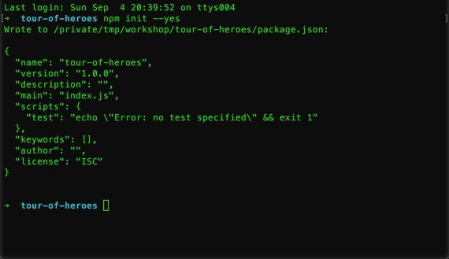
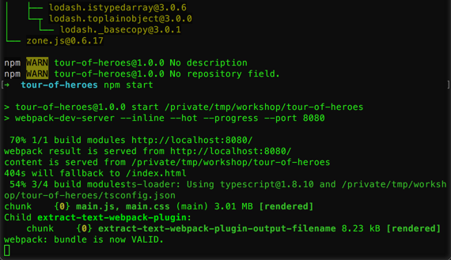
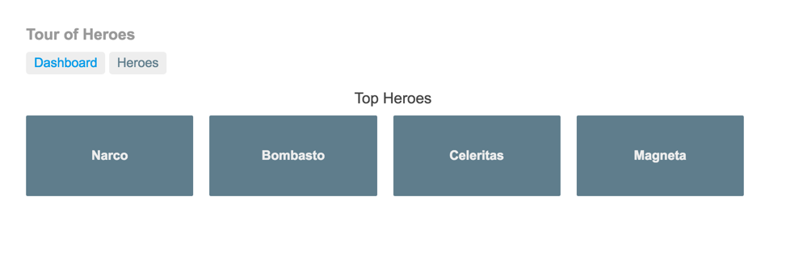

# Creando una app de Angular 2 con Webpack

[Angular 2](https://angular.io) es la evolución de uno de los frameworks webs modernos más utilizados. En el caso de esta segunda versión, se optó por realizar el desarrollo utilizando [TypeScript](https://www.typescriptlang.org), un lenguaje que compila a _JavaScript_ y que brinda mayor seguridad a la hora de crear desarrollos más grandes gracias al manejo de tipos y de clases. _Angular 2_ busca ser un mejor framework web basandose en todo lo aprendido con su versión anterior. Entre otras cosas apunta a mejorar la performance con respecto a su versión anterior, así como a brindar un conjunto de herramientas más modernas, como por ejemplo, permitiendo utilizarse en dispositivos móviles creando componentes nativos gracias a [NativeScript](https://www.nativescript.org) y similares.

Junto con la aparición de frameworks web más modernos, aparecen nuevas necesidades y con ellas, nuevas herramientas. Este es el caso de [Webpack](https://webpack.github.io), que fue tomando impulso en el último tiempo. _Webpack_ es un bundler de módulos, lo cual implica que junta archivos con sus dependencias y genera archivos estáticos. Para el caso de _Angular 2_ con _TypeScript_, también va a servir para compilar el código a _JavaScript_, así como también minificarlo y otro tipo de tareas similares.

El [tutorial oficial de Angular 2](https://angular.io/docs/ts/latest/tutorial/) utiliza [System.js](https://github.com/systemjs/systemjs) en lugar de utilizar _Webpack_, pero como parte de este módulo se verá como crear la misma aplicación utilizando esta otra herramienta, dado que nos va a ayudar a la hora de integrar con _ASP.NET Core_.

En este módulo vamos a crear una aplicación base con **Angular 2** usando **Typescript** y **Webpack** basada en el tutorial oficial de Angular 2 que crea un sitio llamado _Tour Of Heroes_. 

## Tarea 1: Creando la estructura base

A la hora de crear una aplicación con _Angular 2_, necesitamos configurar las dependencias por medio de [npm](https://www.npmjs.com), configurar _TypeScript_ (en el caso de usar este lenguaje) junto con las definiciones de los tipos faltantes. En esta tarea se crearan estas dependencias/configuraciones.

1. Crear una carpeta para desarrollar la aplicación y abrir una terminal/consola en ese directorio.

1. Inicializar el _package.json_ donde se tendrán las dependencias de _npm_ ejecutando el siguiente comando. El parámetro `--yes` completa los campos que son requeridos con los valores por defecto.

    ```
    npm init --yes
    ```

    

    _Iniciando el package.json_

    > **Nota**: El contenido del archivo debería quedar similar al siguiente.
    > 
    > ```json
    > {
    >    "name": "tour-of-heroes",
    >    "version": "1.0.0",
    >    "description": "",
    >    "main": "index.js",
    >    "scripts": {
    >       "test": "echo \"Error: no test specified\" && exit 1"
    >    },
    >    "keywords": [],
    >    "author": "",
    >    "license": "ISC"
    > }
    > ```

1. Agregar las dependencias para _Angular_ en el _package.json_ agregando el siguiente nodo al json.

    ```json
    "dependencies": {
      "@angular/common": "2.0.0",
      "@angular/compiler": "2.0.0",
      "@angular/core": "2.0.0",
      "@angular/forms": "2.0.0",
      "@angular/platform-browser": "2.0.0",
      "@angular/platform-browser-dynamic": "2.0.0",
      "@angular/router": "3.0.0",
      "bootstrap": "^3.3.7",
      "core-js": "2.4.1",
      "reflect-metadata": "0.1.8",
      "rxjs": "5.0.0-beta.12",
      "zone.js": "0.6.23"
    }
    ```

    > **Nota**: Esto es similar a agregar las dependencias con el comando `npm install --save`. El siguiente comando sería lo mismo que agregar las dependencias a mano en el archivo y aparte ejecutar `npm install` luego.
    >
    > ```
    > npm install --save --save-exact @angular/common@2.0.0 @angular/compiler@2.0.0 @angular/core@2.0.0 @angular/forms@2.0.0 @angular/platform-browser@2.0.0 @angular/platform-browser-dynamic@2.0.0 @angular/router@3.0.0 bootstrap@3.3.7 core-js@2.4.1 reflect-metadata@0.1.8 rxjs@5.0.0-beta.12 zone.js@0.6.23
    > ```

1. Ahora, agregaremos las dependencias de las herramientas que necesitamos para el desarrollo, tales como _TypeScript_ y _Webpack_. Para esto agregar el siguiente nodo dentro del _package.json_.

    ```json
    "devDependencies": {
      "angular2-template-loader": "0.5.0",
      "css-loader": "0.25.0",
      "extract-text-webpack-plugin": "1.0.1",
      "file-loader": "0.9.0",
      "html-loader": "0.4.4",
      "raw-loader": "0.5.1",
      "rimraf": "2.5.4",
      "style-loader": "0.13.1",
      "ts-loader": "0.8.2",
      "typescript": "1.8.10",
      "typings": "1.3.3",
      "webpack": "1.13.2",
      "webpack-dev-server": "1.15.2",
      "webpack-merge": "0.14.1"
    }
    ```

    > **Nota 1**: Nuevamente, esto es similar a agregar las dependencias con el comando `npm install --save-dev` (notar la diferencia entre `--save` y `--save-dev`). El siguiente comando equivale a agregar las dependencias a mano en el archivo y aparte ejecutar `npm install` luego.
    >
    > ```
    > npm install --save-dev --save-exact angular2-template-loader@0.5.0 css-loader@0.25.0 extract-text-webpack-plugin@1.0.1 file-loader@0.9.0 html-loader@0.4.4 raw-loader@0.5.1 rimraf@2.5.4 style-loader@0.13.1 ts-loader@0.8.2 typescript@1.8.10 typings@1.3.3 webpack@1.13.2 webpack-dev-server@1.15.2 webpack-merge@0.14.1
    > ```

    > **Nota 2**: En realidad, todas las dependencias en estos casos son dependencias de desarrollo (es decir _devDependencies_) dado que las herramientas van a copiar lo requerido de nuestras dependencias a los archivos que se utilizarán en producción. Sin embargo, se separan las dependencias para simplificar la comprensión de cuáles son dependencias de la aplicación y cuales de las herramientas.

1. Por último, vamos a agregar algunos scripts al _package.json_ actualizando el nodo _scripts_ con el siguiente contenido.

    ```json
    "scripts": {
      "test": "echo \"Error: no test specified\" && exit 1",
      "start": "webpack-dev-server --inline --hot --progress --port 8080",
      "build": "rimraf dist && webpack --config config/webpack.prod.js --progress --profile --bail",
      "postinstall": "typings install"
    },
    ```

    > **Nota**: A continuación una breve descripción de cada script.
    >
    > - **postinstall**: Este script se ejecutará automáticamente después de ejecutar `npm install` e instalará los _typings_ definidos. _Typings_ es una herramienta que nos sirve para agregar definiciones de tipos a _TypeScript_.
    > 
    > - **start**: Este script ejecutará el server de desarrollo de _Webpack_ en el puerto 8080. Utilizará el archivo _webpack.config.js_ que se creará en la próxima tarea para la configuración de _Webpack_.
    > 
    > - **build**: Este script borra la carpeta _dist_ y ejecuta _Webpack_ utilizando la configuración en _config/webpack.prod.js_ que se creará en la próxima tarea.

1. Ahora, crear un nuevo archivo llamado _tsconfig.json_. Este archivo contiene las configuraciones para _TypeScript_. 

1. Agregar el siguiente contenido al archivo recién creado.

    ```json
    {
      "compilerOptions": {
        "target": "es5",
        "module": "commonjs",
        "moduleResolution": "node",
        "sourceMap": true,
        "emitDecoratorMetadata": true,
        "experimentalDecorators": true,
        "removeComments": false,
        "noImplicitAny": false
      }
    }
    ```

1. Agregar un nuevo archivo llamado _typings.json_, que tendrá las dependencias de definiciones de tipos de _TypeScript_ que son necesarias. 

1. Agregar el siguiente contenido al archivo recién creado.

    ```json
    {
      "globalDependencies": {
        "core-js": "registry:dt/core-js#0.0.0+20160725163759",
        "node": "registry:dt/node#6.0.0+20160831021119"
      }
    }
    ```

1. Por último, instalar todas las dependencias ejecutando el siguiente comando.

    ```
    npm install
    ```

    > **Nota**: Esto debería crear dos nuevas carpetas *node_modules* y _typings_. Si no se creó la carpeta _typings_ ejecutar el comando nuevamente. Si el error persiste, ejecutar el comando *npm install -g typings* y luego *typings install*.


## Tarea 2: Configurando _Webpack_

En esta tarea se crearán los archivos de configuración de _Webpack_. Para eso, se tendrán un archivo por para la configuración de desarrollo, otro para la de producción y uno más con la configuración en común.

1. Crear un archivo con el nombre _webpack.config.js_. Este tendrá la configuración por defecto de _Webpack_.

1. Agregar el siguiente contenido al archivo recién creado. Con esto se usará la configuración de desarrollo siempre se creará en los próximos pasos.

    ```js
    module.exports = require('./config/webpack.dev.js');
    ```

1. Ahora, crear la carpeta _config_ y crear el archivo _helpers.js_.

1. Agregar el siguiente contenido al archivo recién creado, que contiene una función que nos ayuda a resolver el path desde el root de la solución.

    ```js
    var path = require('path');
    var _root = path.resolve(__dirname, '..');

    function root(args) {
      args = Array.prototype.slice.call(arguments, 0);
      return path.join.apply(path, [_root].concat(args));
    }

    exports.root = root;
    ```

1. Ahora, agregar el archivo de configuración en común de _Webpack_. Para esto crear el archivo _webpack.common.js_ dentro de la carpeta _config_.

1. Agregar el siguiente contenido al archivo creado en el paso anterior.

    ```js
    var webpack = require('webpack');
    var ExtractTextPlugin = require('extract-text-webpack-plugin');
    var helpers = require('./helpers');

    module.exports = {
      entry: {
        'main': helpers.root('ClientApp', 'main.ts')
      },

      resolve: {
        extensions: ['', '.js', '.ts']
      },

      module: {
        loaders: [
          {
            test: /\.ts$/,
            include: /ClientApp/,
            loaders: ['ts', 'angular2-template-loader']
          },
          {
            test: /\.html$/,
            loader: 'html'
          },
          {
            test: /\.(png|jpe?g|gif|svg|woff|woff2|ttf|eot|ico)$/,
            loader: 'file?name=assets/[name].[hash].[ext]'
          },
          {
            test: /\.css$/,
            exclude: helpers.root('ClientApp', 'app'),
            loader: ExtractTextPlugin.extract('style', 'css?sourceMap')
          },
          {
            test: /\.css$/,
            include: helpers.root('ClientApp', 'app'),
            loader: 'raw'
          }
        ]
      }
    };
    ```

    > **Nota**: En esta configuración se definen tres items:
    > 
    > - **El punto de entrada** (_entry_): en este caso será el archivo _main.ts_ dentro de la carpeta _ClientApp_ que se creará en la próxima tarea.
    > - **Los tipos de archivos a resolver** (_resolve_): se buscarán los archivos con las extensiones en el orden de aparición, lo cual implica que para un import de un archivo llamado _file_, primero se buscará _file_, luego _file.js_ y por último _file.ts_.
    > - **Los módulos, especialmente los loaders** (_module_): cada tipo de archivo es cargado por un módulo especial de webpack. En este punto se definen las regex para detectar el archivo y los loaders a utilizar.

1. Ahora, crear el archivo _webpack.dev.js_ dentro de la carpeta _config_, que tendrá las configuraciones propias de desarrollo.

1. Agregar el siguiente contenido al archivo recién creado.

    ```js
    var webpackMerge = require('webpack-merge');
    var ExtractTextPlugin = require('extract-text-webpack-plugin');
    var commonConfig = require('./webpack.common.js');
    var helpers = require('./helpers');

    module.exports = webpackMerge(commonConfig, {
      devtool: 'cheap-module-eval-source-map',

      output: {
        path: helpers.root('dist'),
        publicPath: 'http://localhost:8080/',
        filename: '[name].js'
      },

      plugins: [
        new ExtractTextPlugin('[name].css')
      ],

      devServer: {
        historyApiFallback: true,
        stats: 'minimal'
      }
    });
    ```

    > **Nota**: Este código utiliza _webpack-merge_ para unir la configuración definida anteriormente en el archivo _webpack.common.js_ con al definida en este archivo. 
    >
    > Esta configuración define los siguientes items:
    > 
    > - **Herramientas de desarrollo** (_devtool_): acá se define el tipo de herramienta que se utilizará para ayudar a debuggear la aplicación creando source maps.
    > - **El punto de salida** (_output_): en este caso será un archivo llamado igual al definido en el punto de entrada (osea, _main_) en la carpeta _dist_ y se expondrá como parte del web server que brinda webpack en el puerto 8080.
    > - **Plugins**: acá se define el plugin que va a extraer los estilos al archivo _css_ con nombre igual al punto de entrada (osea, _main_).
    > - **Configuraciones propias del server de desarrollo** (_devServer_): el servidor de desarrollo de webpack tiene varias configuraciones disponibles, en este caso configuramos para que soporte crear una Single Page Application (SPA), soportando cualquier tipo de path.

1. Por último, crear el archivo para las configuraciones de producción llamado _webpack.prod.js_ dentro de la carpeta _config_.

1. Agregar el siguiente contenido al archivo recién creado.

    ```js
    var webpack = require('webpack');
    var webpackMerge = require('webpack-merge');
    var ExtractTextPlugin = require('extract-text-webpack-plugin');
    var commonConfig = require('./webpack.common.js');
    var helpers = require('./helpers');

    const ENV = process.env.NODE_ENV = process.env.ENV = 'production';

    module.exports = webpackMerge(commonConfig, {
      devtool: 'source-map',

      output: {
          path: helpers.root('dist'),
          filename: '[name].js',
          publicPath: '/'
      },

      htmlLoader: {
        minimize: false // workaround for ng2
      },

      plugins: [
        new webpack.NoErrorsPlugin(),
        new webpack.optimize.DedupePlugin(),
        new webpack.optimize.UglifyJsPlugin(),
        new ExtractTextPlugin('[name].css'),
        new webpack.DefinePlugin({
          'process.env': {
            'ENV': JSON.stringify(ENV)
          }
        })
      ]
    });
    ```

    > **Nota**: Este código es similar al de la configuración de desarrollo, con la diferencia de los plugins que utiliza, realizando tareas típicas como minificación de _JavaScript_ y _CSS_, entre otras cosas. Aparte, la salida es un archivo físico en el directorio _dist_.

## Tarea 3: Creando la aplicación base

1. Crear el archivo _index.html_ dentro de la carpeta raíz de la aplicación (donde está el _package.json_).

    ```html
    <!DOCTYPE html>
    <html>
      <head>
        <base href="/">
        <title>Tour of Heroes</title>
        <meta charset="UTF-8">
        <meta name="viewport" content="width=device-width, initial-scale=1">
        <link rel="stylesheet" href="/main.css" />
      </head>
      <body>
        <my-app>Loading...</my-app>

        <script src="/main.js" ></script>
      </body>
    </html>
    ```

    > **Nota**: El directorio y los nombres de los archivos de _JavaScript_ y _CSS_ fueron definidos en la configuración de _Webpack_.

1. Crear una carpeta con el nombre _ClientApp_.

    > **Nota**: El nombre de esta carpeta fue utilizado en la configuración de _Webpack_. Si se prefiere utilizar otro, asegurarse de cambiarlo en esa configuración.

1. Ahora, crear el archivo _main.ts_ dentro de la carpeta _ClientApp_ que es el punto de entrada definido en nuestras configuraciones de _Webpack_.

1. Agregar el siguiente contenido al archivo recién creado.

    ```js
    import './vendor';
    
    import { platformBrowserDynamic } from '@angular/platform-browser-dynamic';
    import { enableProdMode } from '@angular/core';
    import { AppModule } from './app/app.module';

    import './public/styles.css'

    if (process.env.ENV === 'production') {
      enableProdMode();
    }

    platformBrowserDynamic().bootstrapModule(AppModule);
    ```

1. Luego, crear el archivo _vendor.ts_ dentro de la carpeta _ClientApp_. Este archivo tendrá todas las referencias a frameworks y polyfills (funciones que nos completan funcionalidad que no está disponible en el browser) requeridas por nuestra aplicación.

1. Agregar el siguiente contenido al archivo recién creado.

    ```js
    // Polyfills
    import 'core-js/es6';
    import 'core-js/es7/reflect';
    require('zone.js/dist/zone');

    if (process.env.ENV === 'production') {
      // Production
    } else {
      // Development
      Error['stackTraceLimit'] = Infinity;
      require('zone.js/dist/long-stack-trace-zone');
    }

    // Angular 2
    import '@angular/platform-browser';
    import '@angular/platform-browser-dynamic';
    import '@angular/core';
    import '@angular/common';
    import '@angular/router';

    // RxJS
    import 'rxjs';

    // Other vendors for example jQuery, Lodash or Bootstrap
    // You can import js, ts, css, sass, ...
    ```

1. Por último, agregar el contenido de la carpeta _assets_ dentro de la carpeta _ClientApp_. Estos archivos están basados en el resultado final del tutorial oficial de _Angular 2_.

    > **Nota**: La carpeta _assets_ contiene dos carpetas, una llamada _public_ y la otra _app_. La primera, contiene estilos utilizados en la aplicación. 
    >
    > La carpeta _app_ contiene definiciones de componentes, modelos, servicios y módulos de la aplicación detalladas a continuación:
    >
    > - **app.component**: este componente es el que podríamos denominar _layout_ de la aplicación, incluyendo el título y la barra de navegación.
    >
    > - **app.module**: este archivo, define el módulo con todas sus dependencias. Este módulo, es el utilizado para arrancar la aplicación.
    >
    > - **app.routing**: en este archivo están definidas todas las rutas del lado del cliente.
    >
    > - **dashboard.component**: este componente es el primero que se visualiza que muestra recuadros con algunos héroes.
    >
    > - **hero**: este es el modelo utilizado en todos los componentes y servicios.
    >
    > - **hero-detail.component**: este componente es el detalle de los héroes, que permite su modificación.
    >
    > - **hero.service**: este es el servicio que tiene todas las operaciones sobre los héroes (altas, bajas, modificaciones, etc.)
    >
    > - **heroes.component**: este componente es el listado de héroes.


## Tarea 4: Corriendo la aplicación

1. En la consola/terminal, ejecutar el siguiente comando.

    ```
    npm start
    ```

    

    _Ejecutando la aplicación_    

1. Abrir un navegador e ir a [http://localhost:8080](http://localhost:8080).

    

    _Navegando a la aplicación_

1. Jugar con la app un poco, seleccionando un héroe, modificando su nombre, creando nuevos y borrando los existentes.

    

    _Jugando con la aplicación_

    > **Nota**: La imagen es del tutorial oficial de _Angular 2_.

1. Luego de probar la app, terminar la aplicación en la consola con **Ctrl + C**.

## Conclusiones

Las aplicaciones web modernas soportan crear aplicaciones de notoria complejidad con un costo a la hora de inicializar el desarrollo de la misma.

Luego de terminado este módulo, se cuetan con los conocimientos básicos para crear este tipo de aplicaciones sin problemas. Ahora solo queda consumir los datos desde una API y servir los archivos en producción.
