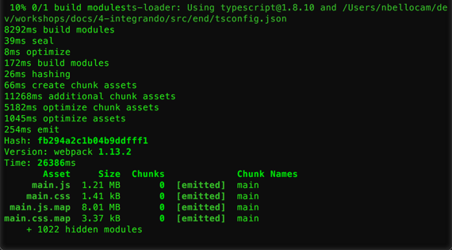
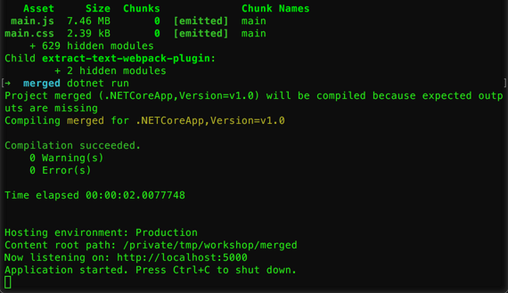
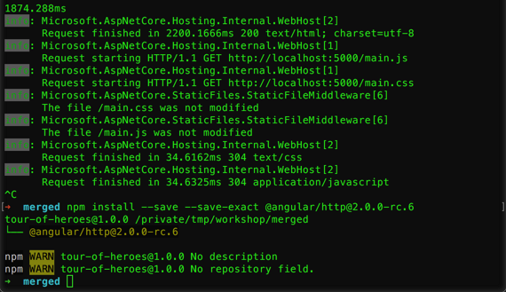
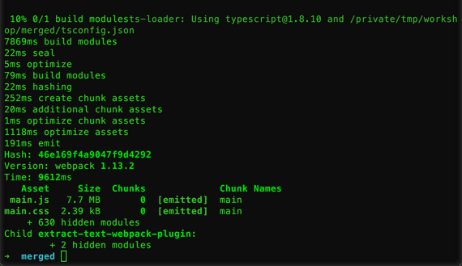
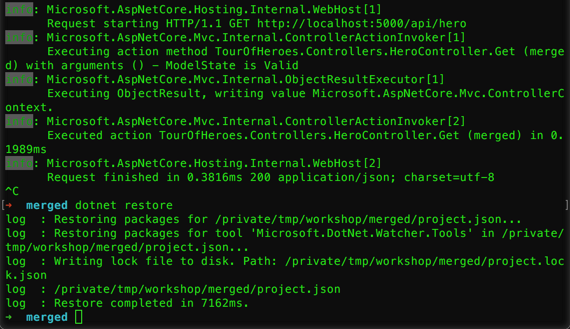
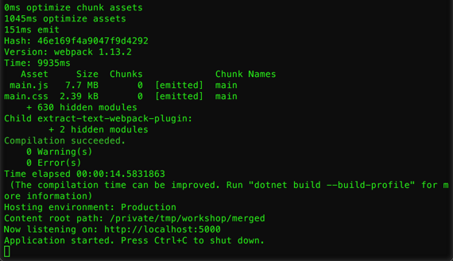
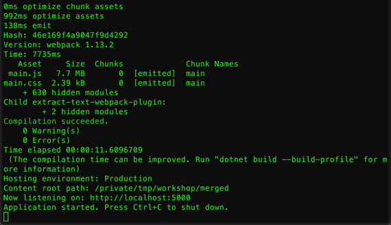

# Integrando Angular 2 con ASP.NET Core

Por más que hoy en día se suelen hacer desarrollos por separado, creando APIs por un lado y el front end por el otro, normalmente estas dos partes se unen.

Es momento de empezar a integrar los módulos anteriores, haciendo que la aplicación de _Angular 2_ consuma la API creada con _ASP.NET Core_. Aparte de esto, la aplicación creada en _ASP.NET Core_ puede servir la aplicación cliente.

En este módulo veremos una primer versión de esta integración, realizando todo a mano.

## Tarea 1: Integrando las soluciones

1. Crear una nueva carpeta donde trabajar.

1. Abrir la carpeta _begin_ que se encuentra dentro de la carpeta _src_ y copiar el contenido de la carpeta _server_ a la carpeta de trabajo.

    > **Nota**: El contenido de esta carpeta es el mismo que el que se genera cuando se termina el módulo de **ASP.NET Core**.

1. Ahora repetir la operación con el contenido de la carpeta _client_

    > **Nota**: El contenido de esta carpeta es el mismo que el que se genera cuando se termina el módulo de **Angular 2**.

1. Luego de tener todo el contenido junto, hay que actualizar ambas aplicaciones para que el server sirva los archivos del cliente. El primer paso será agregar el soporte para archivos estáticos en el server. Para eso, agregar la siguiente dependencia en el _project.json_.

    ```json
    "Microsoft.AspNetCore.StaticFiles": "1.0.0"
    ```

1. Ejecutar en la terminal `dotnet restore` para actualizar las dependencias y el _project.lock.json_.

1. Ahora, agregar al método _Configure_ de la clase _Startup_ la llamada `app.UseStaticFiles();`.

    ```csharp
    public void Configure(IApplicationBuilder app, IHostingEnvironment env, ILoggerFactory loggerFactory)
    {
      loggerFactory.AddConsole(Configuration.GetSection("Logging"));
      loggerFactory.AddDebug();

      app.UseStaticFiles();
      
      app.UseMvc();
    }
    ```

1. Luego, crear la carpeta _wwwroot_ que será la que tenga los archivos estáticos.

1. Con esto el servidor ya está actualizado y queda el cliente. Para esto, el primer pasó es actualizar el nodo output del archivo _webpack.prod.js_ (dentro de la carpeta _config_) para que genere el archivo dentro de la carpeta _wwwroot_.

    ```js
    output: {
      path: helpers.root('wwwroot'),
      filename: '[name].js',
      publicPath: '/'
    },
    ```

1. Luego, mover el archivo _index.html_ a la carpeta _wwwroot_.

1. Ahora, hay que actualizar el script de _build_ de _npm_ que borra la carpeta _dist_ para que borre en su lugar los archivos generados en la carpeta _wwwroot_. Para esto, reemplazar el script por el siguiente.

    ```json
    "scripts": {
      "test": "echo \"Error: no test specified\" && exit 1",
      "start": "webpack-dev-server --inline --hot --progress --port 8080",
      "build": "rimraf wwwroot/*.js wwwroot/*.css wwwroot/*.map && webpack --config config/webpack.prod.js --progress --profile --bail",
      "postinstall": "typings install"
    },
    ```

1. Agregar un nuevo script para la tarea de `dev-build` con el siguiente script. Esta tarea se utilizará para generar los archivos igual que la de `build`, pero para desarrollo (sin minificación ni similares).

    ```json
    "dev-build": "rimraf wwwroot/*.js wwwroot/*.css wwwroot/*.map && webpack --config config/webpack.dev-aspnet.js --progress --profile --bail"
    ```

1. Ahora, crear un nuevo archivo en la carpeta _config_ llamado _webpack.dev-aspnet.js_. Este archivo tendrá la configuración para desarrollo, que es la definida en la tarea recién creada.

1. Agregar al archivo recién creado el siguiente código.

    ```js
    var webpackMerge = require('webpack-merge');
    var ExtractTextPlugin = require('extract-text-webpack-plugin');
    var commonConfig = require('./webpack.common.js');
    var helpers = require('./helpers');

    module.exports = webpackMerge(commonConfig, {
      devtool: 'cheap-module-eval-source-map',

      output: {
        path: helpers.root('wwwroot'),
        filename: '[name].js',
        publicPath: '/'
      },

      plugins: [
        new ExtractTextPlugin('[name].css')
      ]
    });
    ```

    > **Nota**: Este archivo es muy similar al de  _webpack.dev.js_ con la diferencia del nodo de _output_ y que no tiene el nodo _devServer_. Aparte notar que el nodo _output_ es el mismo que el de _webpack.prod.js_.

1. Generar los archivos del cliente, ejecutando en la terminal/consola `npm run dev-build`.

    
    
    _Generando los archivos del cliente_

    > **Nota**: Si no se copió las carpeta _node_modules_ y _typings_, ejecutar `npm install` antes de ejecutar el comando.

1. Ahora, ejecutar la aplicación con `dotnet run`.

    
    
    _Corriendo la aplicación_


1. Navegar a [http://localhost:5000/index.html](http://localhost:5000/index.html) y comprobar que funcione.

1. Terminar la aplicación con **Ctrl + C**.

> **Nota**: Este proceso es muy manual y propenso a errores. Aparte de esto, notar que si se actualiza la página o si no se pone explícitamente el archivo _index.html_, entonces el sitio quedará en blanco.
>
> En las próximas tareas se harán cambios para mejorar estos temas.

## Tarea 2: Actualizando el manejo de rutas

En la tarea anterior se unieron ambas aplicaciones de forma manual. Ahora se arreglaran las rutas para que ante cualquier request se devuelva el cliente hecho en _Angular 2_, dado que las rutas se resuelven de este lado.

1. Primero, crear un nuevo archivo llamado _HomeController.cs_ dentro de la carpeta _Controllers_.

1. Agregar el siguiente contenido al archivo recién creado.

    ```csharp
    using Microsoft.AspNetCore.Mvc;

    namespace TourOfHeroes.Controllers
    {
      public class HomeController : Controller
      {
        public IActionResult Index()
        {
          return View();
        }
      }
    }
    ```

    > **Nota**: Este controlador y la action _Index_ serán utilizados por defecto para devolver el cliente de _Angular 2_.

1. Ahora, crear la carpeta _Views_ y dentro de esta otra carpeta llamada _Home_.

1. Mover el archivo _index.html_ de la carpeta _wwwroot_ a la nueva carpeta _Home_ y renombrarlo a _Index.cshtml_.

    > **Nota**: Con esto se convirtió el archivo original en la vista de la acción _Index_ del controlador _Home_.

1. Abrir el _project.json_ y agregar la siguiente línea dentro del nodo de _buildOptions_.

    ```json
    "preserveCompilationContext": true
    ```

    > **Nota**: El nodo de _buildOptions_ debería quedar como el siguiente.
    > 
    > ```json
    > "buildOptions": {
    >   "debugType": "portable",
    >   "emitEntryPoint": true,
    >   "preserveCompilationContext": true    
    > },
    > ```
    >
    > Esto es requerido por el engine Razor, incluso para este caso donde no estamos usando ninguna de las herramientas que probee.

1. Por último, actualizar la llamada al método _UseMvc_ en el método _Configure_ de la clase _Startup_ con el siguiente.

    ```csharp
    app.UseMvc(routes =>
    {
      routes.MapRoute(
        name: "default",
        template: "{controller=Home}/{action=Index}/{id?}");

      routes.MapRoute(
        name: "spa-fallback",
        template: "{*url}",
        defaults: new { controller = "Home", action = "Index" });
    });
    ```

    > **Nota**: Esta configuración hace que ante cualquier request que no se pueda resolver se devuelva el resultado de la action _Index_ del controller _Home_.

1. Ahora, ejecutar nuevamente la aplicación con `dotnet run`.

    > **Nota**: En esta oportunidad no modificamos el cliente, con lo cual no hace falta volver a generar el paquete con `npm run dev-build` como en el caso anterior.

1. Navegar a [http://localhost:5000/](http://localhost:5000/) y comprobar que funcione.

    > **Nota**: En esta oportunidad, podemos probar de actualizar el sitio y deberíamos volver a la misma página, aunque se perderá el estado.

1. Terminar la aplicación con **Ctrl + C**.

## Tarea 3: Consumiendo la API

1. Agregar el módulo `http` de angular. Para esto ejecutar el siguiente comando.

    ```
    npm install --save --save-exact @angular/http@2.0.0-rc.6
    ```

    

    _Instalando el módulo http_

1. Ahora, abrir el archivo _app.module.ts_ en la carpeta _app_ dentro de _ClientApp_.

1. Agregar el import de _HttpModule_.

    ```js
    import { HttpModule }     from '@angular/http';
    ```

1. Agregar _HttpModule_ como parte de los imports.

    ```js
    @NgModule({
      imports: [
        BrowserModule,
        FormsModule,
        routing,
        HttpModule
      ],
      declarations: [
        AppComponent,
        HeroesComponent,
        DashboardComponent,
        HeroDetailComponent,
      ],
      providers: [
        HeroService
      ],
      bootstrap: [ AppComponent ]
    })
    export class AppModule {
    }
    ```

1. Ahora, abrir el archivo _hero.service.ts_, también en la carpeta _app_ dentro de _ClientApp_.

1. Agregar los siguientes imports del módulo _http_.

    ```js
    import { Headers, Http, Response } from '@angular/http';
    ```

1. Agregar dentro de la clase _HeroService_ la siguiente variable y el constructor.

    ```js
    private heroesUrl = 'api/hero';  // URL to web api

    constructor(private http: Http) { }
    ```

    > **Nota**: Al constructor se le va a inyectar el servicio de http y se guarda como variable privada.

1. Remplazar la implementación del método `getHeroes` con la siguiente.

    ```js
    getHeroes(): Promise<Hero[]> {
      return this.http.get(this.heroesUrl)
                .toPromise()
                .then(response => response.json() as Hero[])
                .catch(this.handleError);
    }
    ```

    > **Nota**: Con esto no se está modificando las firmas de los métodos, solo la implementación. Esta implementación usa el método _get_ del servicio _http_ y luego lo transforma en una promesa gracias a _rxjs_.

1. Ahora, remplazar la implementación del método `getHero` con la siguiente.

    ```js
    getHero(id: number): Promise<Hero> {
      return this.getHeroes()
                .then(heroes => heroes.find(hero => hero.id === id));
    }
    ```

1. Después, remplazar la implementación del método `delete` con la siguiente.

    ```js
    delete(hero: Hero): Promise<Response> {
      let headers = new Headers();
      headers.append('Content-Type', 'application/json');

      let url = `${this.heroesUrl}/${hero.id}`;

      return this.http
                .delete(url, {headers: headers, body:{}})
                .toPromise()
                .catch(this.handleError);
    }
    ```

1. Luego, remplazar la implementación del método `post` con la siguiente.

    ```js
    // Add new Hero
    private post(hero: Hero): Promise<Hero> {
      let headers = new Headers({
        'Content-Type': 'application/json'});

      return this.http
                .post(this.heroesUrl, JSON.stringify(hero), {headers: headers})
                .toPromise()
                .then(res => res.json())
                .catch(this.handleError);
    }
    ```

1. Finalmente, remplazar la implementación del método `put` con la siguiente.

    ```js
    // Update existing Hero
    private put(hero: Hero): Promise<Hero> {
      let headers = new Headers();
      headers.append('Content-Type', 'application/json');

      let url = `${this.heroesUrl}/${hero.id}`;

      return this.http
                .put(url, JSON.stringify(hero), {headers: headers})
                .toPromise()
                .then(() => hero)
                .catch(this.handleError);
    }
    ```

1. Como se modificó el cliente, tenemos que ejecutar `npm run dev-build` para generar los archivos nuevamente.

    

    _Generando los archivos nuevamente_

1. Ahora, ejecutar nuevamente la aplicación con `dotnet run`.

1. Navegar a [http://localhost:5000/](http://localhost:5000/) y comprobar que funcione.

    > **Nota**: En esta oportunidad, podemos probar de actualizar el sitio y deberíamos volver a la misma página y no se perderá el estado.

1. Terminar la aplicación con **Ctrl + C**.

## Tarea 4: Automatizando las actualizaciones

El proceso de tener que correr dos comandos (`npm run dev-build` y `dotnet run`) mientras estamos desarrollando nuestras aplicaciones, no es para nada cómodo. Por esto mismo existen algunos cambios que podemos hacer para facilitarnos la vida.

1. Actualizar el _project.json_, agregando el siguiente nodo _scripts_

    ```json
    "scripts": {
      "precompile": [ "npm run dev-build"],
      "prepublish": [
        "npm install",
        "npm run build"
      ]
    }
    ```

    > **Nota**: El script de _precompile_ se ejecutará siempre que se compile la solución, esto implica que cada vez que corramos `dotnet run`, se ejecutará automáticamente, por lo que no tendremos que ejecutar los dos comandos por separado.
    >
    > Por otro lado, el comando _prepublish_, es ideal para el momento de publicar la solución, instalando todos las dependencias de _npm_ y corriendo el script de producción.
  
1. Agregar el siguiente tooling en el _project.json_.

    ```json
    "tools": {
      "Microsoft.DotNet.Watcher.Tools": "1.0.0-preview2-final"
    }
    ```

    > **Nota**: Con esta herramienta, podremos ejecutar `dotnet watch`, que ante cambios en los archivos _*.cs_, volverá a compilar la solución, sin la necesidad de estar parando y volviendo a arrancar el server con `dotnet run`.

1. Ejecutar `dotnet restore`.

    

    _Ejecutando dotnet restore_

1. Ejecutar `dotnet watch run`.

    

    _Ejecutando dotnet watch run_

1. Finalmente, para probar, actualizar la api de hero cambiando los valores por default y notar en la consola que se vuelve a complicar la aplicación.

    

    _Realizando cambios_

    > **Nota**: _Watch_ no va a ver los cambios en los archivos del cliente, pero si va a compilarlos ante cada cambio en los archivos del server.

1. Terminar la aplicación con **Ctrl + C**.

## Conclusiones

Al terminar este módulo se tiene una aplicación cliente creada con _Angular 2_ que consume una _API REST_ creada en _ASP.NET Core_. Aparte, el servidor se configuró para servir archivos estáticos y manejar las rutas para devolver la aplicación cliente ante rutas no manejadas.

Este módulo mostró una primer versión de como se puede trabajar con ambas tecnologías en simulaneo y como integrarlas.