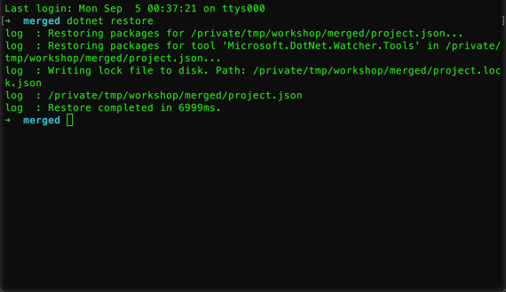
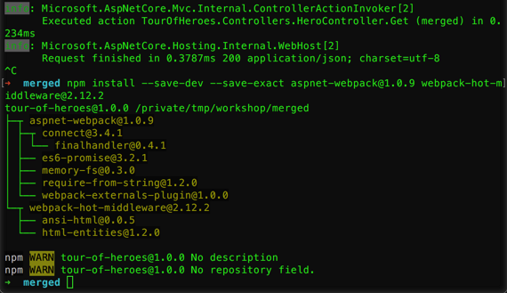
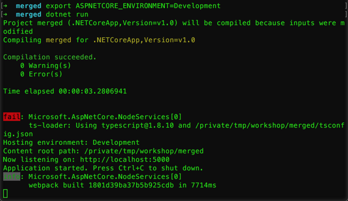
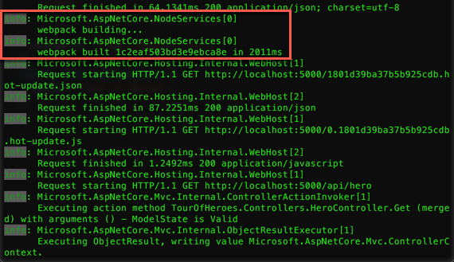

# Introducción a JavaScript Services

[JavaScriptServices](https://github.com/aspnet/JavaScriptServices) es un conjunto de herramientas para _ASP.NET Core_, que entre otras cosas aportan algunos middlewares muy interesantes a la hora de crear _Single Page Applications (SPAs)_ utilizando frameworks modernos como _Angular 2_ o _React.js_.

En este módulo se verán algunas de las herramientas, especialmente las que forman parte de _SpaServices_.

## Tarea 1: Mejorando el manejo de rutas

1. Copiar la solución de la carpeta _begin_ que se encuentra dentro de la carpeta _src_ de este módulo a un lugar para trabajar.

    > **Nota**: El contenido de esta carpeta es el mismo que el que se genera cuando se termina el módulo de integración, por lo que se puede utilizar el creado en vez del de la carpeta _begin_.

1. Agregar _SpaServices_, para esto, abrir el archivo _project.json_ y agregar la siguiente dependencia.

    ```json
    "Microsoft.AspNetCore.SpaServices": "1.0.0-*"
    ```

1. Ejecutar en la terminal `dotnet restore` para actualizar las dependencias y el _project.lock.json_.

    

    _Ejecutando dotnet restore_

1. Ahora, actualizar la ruta de fallback, para esto abrir el archivo _Startup.cs_ y reemplazar la ruta con el nombre `spa-fallback` por la siguiente.

    ```csharp
    routes.MapSpaFallbackRoute(
      name: "spa-fallback",
      defaults: new { controller = "Home", action = "Index" });
    ```

    > **Nota**: Por más que el código parezca muy similar, la ventaja que tiene esta ruta es que maneja casos de archivos que parezcan ser estáticos. Esto implica que si se pide, por ejemplo, `/images/ejemplo.png`, usando la ruta anterior va a devolver la página de Angular 2, mientras que con esta nueva ruta devolverá 404 en caso de no encontrarse el archivo (que es justamente lo esperable para este ejemplo).
    >
    > El código a reemplazar es el siguiente.
    > 
    > ```csharp
    > routes.MapRoute(
    >     name: "spa-fallback",
    >     template: "{*url}",
    >     defaults: new { controller = "Home", action = "Index" });
    > ```

1. Correr la aplicación con `dotnet run` y comprobar que funciona como antes.

1. Terminar la aplicación con **Ctrl + C**.

## Tarea 2: Mejorando la experiencia de desarrollo

1. Antes que nada, se necesitan algunas herramientas más del lado de _Webpack_, por lo cual hay que ejecutar el siguiente comando.

    ```
    npm install --save-dev --save-exact aspnet-webpack@1.0.9 webpack-hot-middleware@2.12.2
    ```

    

    _Instalando las nuevas herramientas_

1. Luego, abrir el archivo _Startup.cs_ y agregar la siguiente sentencia _using_.

    ```csharp
    using Microsoft.AspNetCore.SpaServices.Webpack;
    ```

1. Ahora, agregar el siguiente código dentro del método _Configure_ antes de la llamada a `app.UseStaticFiles();`, para agregar el middleware de _Webpack_ solo para el caso de estar en un entorno de desarrollo.

    ```csharp
    // remember to "set/export ASPNETCORE_ENVIRONMENT=Development"
    if (env.IsDevelopment()) 
    {
      app.UseWebpackDevMiddleware(new WebpackDevMiddlewareOptions {
        HotModuleReplacement = true
      });
    }
    ```

1. Luego, actualizar la configuración por defecto de _Webpack_ para que utilize la que se encuentra en _webpack.dev-aspnet.js_. Para esto, modificar el archivo _webpack.config.js_ con el siguiente contenido.

    ```js
    module.exports = require('./config/webpack.dev-aspnet.js');
    ```

1. Agregar el soporte para _Hot Module Replacement_ (HMR) en el cliente, agregando el siguiente código al final del archivo _main.ts_.

    ```typescript
    // Basic hot reloading support. Automatically reloads and restarts the Angular 2 app each time
    // you modify source files. This will not preserve any application state other than the URL.
    declare var module: any;
    if (module.hot) {
      module.hot.accept();
    }
    ```

1. Antes de correr la aplicación, actualizar el _project.json_ para eliminar la tarea que se corre antes de cada build. Para esto, eliminar la siguiente línea.

    ```json
    "precompile": [ "npm run dev-build"],
    ```

1. Para probar estos cambios hay que cambiar el entorno a _desarrollo_, para esto ejecutar el siguiente comando.

    - En windows:

        ```
        set ASPNETCORE_ENVIRONMENT=Development
        ```

    - En Mac/Linux:

        ```
        export ASPNETCORE_ENVIRONMENT=Development
        ```

1. Correr la aplicación con `dotnet run`.

    

    _Ejecutando la aplicación_

1. Una vez que está corriendo la aplicación, comprobar que funciona como antes.

1. Ahora, abrir el archivo _app.component.ts_ dentro de la carpeta _app_ en _ClientApp_ y modificar el template del título.

    ```
    <h1>{{title}} updated</h1>
    ```
    
1. Notar que el navegador se actualiza automáticamente ante estos cambios sin necesidad de reiniciar el servidor, ni similares.

    

    _Actualización automática del servidor_

1. Terminar la aplicación con **Ctrl + C**.

## Conclusiones

_ASP.NET Core_ tiene muchas herramientas para desarrollo moderno de aplicaciones. _JavaScriptServices_ nos permite crear aplicaciones modernas de forma mucho más fácil y rápido. Es importante notar que estas herramientas se encuentran en constante desarrollo con lo cual a futuro pueden existir aún mas y mejores herramientas.